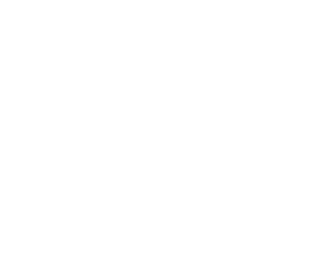

<!-- PROJECT LOGO -->
 

<h3 align="center">Certified Full Stack Developer Curriculum</h3>

    freeCodeCamp Course
     
    <a href="https://www.freecodecamp.org/learn/full-stack-developer/"><strong>Explore the course »</strong></a>
     
     
    <a href="https://freecodecamp.org/certification/gulpanjul/responsive-web-design">View Certification</a>
  

[![The Certification][the-certification]](https://freecodecamp.org/certification/gulpanjul/responsive-web-design)

<!-- ABOUT THE PROJECT -->

## About The Project

This repository contains my learning journey while completing the **Responsive Web Design Certification**.

Through this project, I explored the core web technologies:

- **HTML (Hypertext Markup Language)** for building webpage structure and content.
- **CSS (Cascading Style Sheets)** for styling and visual design.

<!-- ROADMAP -->

## Roadmap

- [x] Learn HTML by Building a Cat Photo App
- [x] Learn Basic CSS by Building a Cafe Menu
- [x] Learn CSS Colors by Building a Set of Colored Markers
- [x] Learn HTML Forms by Building a Registration Form
- [x] **Certification Project**: Survey Form
- [x] Learn the CSS Box Model By Building a Rothko Painting
- [x] Learn CSS Flexbox by Building a Photo Gallery
- [x] Learn Typography by Building a Nutrition Label
- [x] Learn Accessibility by Building a Quiz
- [x] **Certification Project**: Tribute Page
- [x] Learn More About CSS Pseudo Selectors by Building A Balance Sheet
- [ ] Learn Intermediate CSS by Building a Cat Painting
- [ ] Learn Responsive Web Design by Building a Piano
- [ ] **Certification Project**: Technical Documentation Page
- [ ] Learn CSS Variables by Building a City Skyline
- [ ] **Certification Project**: Product Landing Page
- [ ] Learn CSS Animation by Building a Ferris Wheel
- [ ] Learn CSS Transforms by Building a Penguin
- [ ] **Certification Project**: Personal Portfolio Webpage

[the-certification]: images/certification.png
